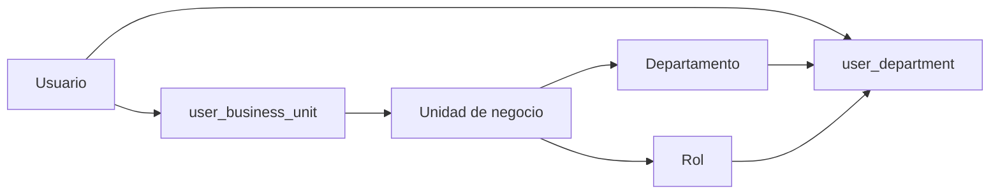
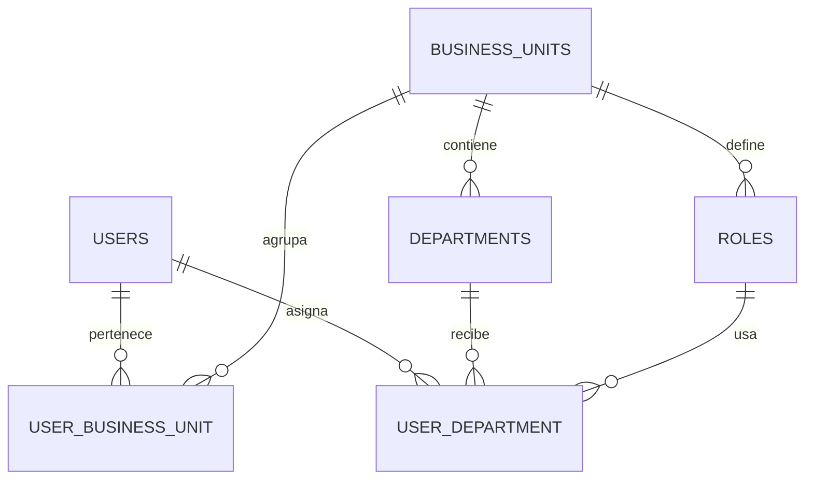

# Arquitectura del Backend

Este documento explica como trabajan juntos los usuarios, las unidades de negocio, los departamentos y los roles en el ERP.

## Idea central

- `users` son personas globales dentro del sistema.
- `business_units` representan cada negocio.
- `departments` viven dentro de una unidad de negocio.
- `roles` tambien viven dentro de una unidad de negocio.
- `user_department` es la asignacion que conecta un usuario con un departamento y un rol.

## Flujo de asignacion

## Que significa esto

### Unidad de negocio

Controla a que negocio pertenece el usuario.

### Departamento

Controla el area dentro de ese negocio.

### Rol

Controla el puesto o la responsabilidad dentro de ese departamento.

## Reglas

1. Un rol puede existir en una unidad de negocio y no en otra.
2. Un departamento puede existir en una unidad de negocio y no en otra.
3. El mismo usuario puede tener asignaciones distintas en diferentes unidades de negocio.
4. El mismo nombre de rol puede reutilizarse entre negocios si hace falta.

## Ejemplo

- En Momentto Garden:
  - Departamento: Ventas
  - Rol: Seller
- En Viajes Premium:
  - Departamento: Reservaciones
  - Rol: Agent

El mismo usuario puede estar en ambos negocios con diferentes departamentos y diferentes roles.

## Ejemplo de tablas

Supongamos que existe una usuaria llamada Ana Lopez que pertenece a los dos negocios, pero con un rol diferente en cada uno.

### users

| id  | name         | email            |
| --- | ------------ | ---------------- |
| 1   | Karim Bernal | karim@correo.com |

### business_units

| id  | name            |
| --- | --------------- |
| 1   | Momentto Garden |
| 2   | Viajes Premium  |

### user_business_unit

| id  | user_id | business_unit_id | is_active |
| --- | ------- | ---------------- | --------- |
| 1   | 1       | 1                | true      |
| 2   | 1       | 2                | true      |

### departments

| id  | business_unit_id | name          |
| --- | ---------------- | ------------- |
| 1   | 1                | Ventas        |
| 2   | 1                | Operaciones   |
| 3   | 2                | Reservaciones |
| 4   | 2                | Ventas        |

### roles

| id  | business_unit_id | name        |
| --- | ---------------- | ----------- |
| 1   | 1                | seller      |
| 2   | 1                | coordinator |
| 3   | 2                | agent       |
| 4   | 2                | manager     |

### user_department

| id  | user_id | department_id | role_id |
| --- | ------- | ------------- | ------- |
| 1   | 1       | 1             | 1       |
| 2   | 1       | 3             | 3       |

### Lectura del ejemplo

- Ana pertenece a Momentto Garden y a Viajes Premium.
- En Momentto Garden trabaja en Ventas con rol seller.
- En Viajes Premium trabaja en Reservaciones con rol agent.
- Si despues se le asigna otro puesto dentro del mismo negocio, solo se agrega otra fila en `user_department`.

## Mini diagrama ER

